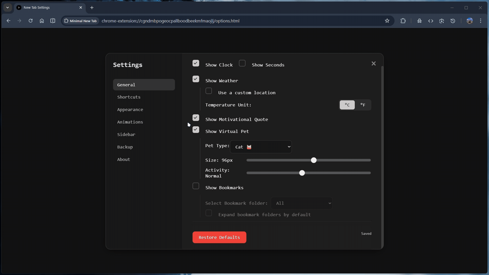

# Minimal New Tab

✨ A clean, minimal, customizable **New Tab page** for Chrome, with:
- 📅 Digital clock (hours + minutes)
- 🌤️ Weather of your current location
- 🔍 Search bar that focuses the address bar
- ⭐ Bookmarks (organized in folders, collapsible tree view)
- 🌓 Theme support: light, dark, and system preference toggle
- 🖤 Monospace, minimal aesthetic

---

## 🚀 Features

- Minimal, distraction-free design  
- Digital clock at center  
- Current weather for your geolocation (via [Open-Meteo](https://open-meteo.com/))
- Bookmarks with folder structure preserved, collapsible  
- Theme switcher: dark, light, system — remembers your choice  
- Fully client-side, no analytics or tracking

---

## ✨ Enhancements in This Fork

This repository is based on the original project by **Ujjwal Jain** and extends it with several additional features while preserving the minimal design.

New features added in this fork:

* 🐾 **Animated Pets** — A small pet (dog, cat, rabbit, etc.) walks along the footer for a playful touch.
* 💬 **Motivational Quotes** — Inspirational quotes appear below the weather section.
* 🎨 **Interactive Backgrounds** — Mouse-responsive backgrounds with optimized performance:

  * Rain
  * Matrix
  * Petals
  * Gravitational particles etc.
* 🔗 **Custom Shortcuts** — Ability to add your own quick-access website shortcuts.
* 🧰 **Expanded Sidebar Tools** — Additional useful tools integrated into the sidebar.
* 🗃️ Auto-save feature added.

All new visual effects are designed to remain **lightweight and memory-efficient** so the new tab page stays fast and responsive.

---


## 📷 Screenshots

|           Dark Theme              |         Light Theme                 |
|-----------------------------------|-------------------------------------|
|  |  |
| Options                           |         Sidebar                     |
||  |


---

## Installation (CRX)

[](https://chromewebstore.google.com/detail/minimal-new-tab/hdodpjlgcieifmkkidligdnonbfiijnd)


For manual installation, clone this repository and [load it as an unpacked extension](https://developer.chrome.com/docs/extensions/get-started/tutorial/hello-world#load-unpacked).

Clone this fork:

```bash
git clone https://github.com/RohitKSahoo/Minimal_Tab.git
```

Original project:

```bash
git clone https://github.com/ujain1999/minimal_newtab.git
```
